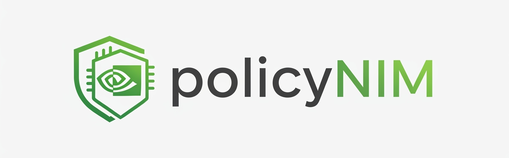
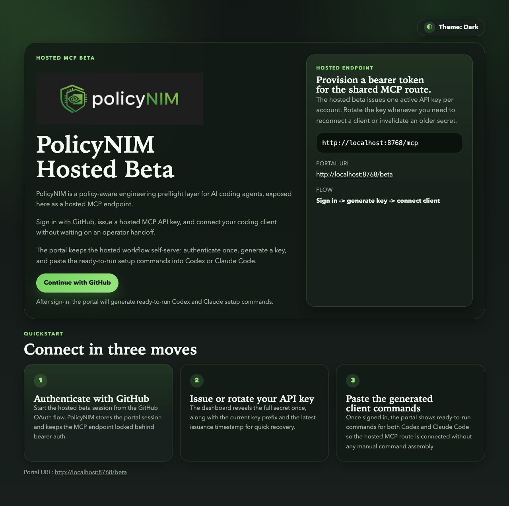

# PolicyNIM

<p align="center">
  <picture>
    <source
      media="(prefers-color-scheme: dark)"
      srcset="src/policynim/assets/beta/policynim_darkmode.jpg"
    >
    
  </picture>
</p>

[](https://docs.nvidia.com/nim/)

PolicyNIM is a policy-aware engineering preflight layer for AI coding agents.

It helps an agent retrieve grounded policy evidence, generate implementation
guidance with citations attached, and fail closed when the available grounding
is too weak to trust.

PolicyNIM currently ships with two main user-facing surfaces:

- a JSON-first CLI for local developer workflows
- an MCP server for integrations such as Codex and Claude Code

## What Works Today

- Deterministic Markdown ingest with heading-aware chunking and source line spans.
- Ingest-time compilation of `runtime_rules` frontmatter into the persisted runtime rules artifact.
- NVIDIA-hosted embeddings and reranking for retrieval.
- Local sqlite-vec storage for the retrievable policy index.
- Task-aware policy routing with citation-preserving selected-policy packets.
- Policy compilation into citation-backed planning and generation constraints.
- Grounded preflight synthesis with compiled plan steps, citation validation, and
  fail-closed fallback.
- Opt-in preflight evidence traces that link chunks, selected policies, compiled
  constraints, generated guidance, and conformance checks.
- Opt-in policy-backed regeneration for preflight and eval preflight cases,
  reusing the same compiled packet and typed conformance failures as retry
  triggers.
- Eval backend selection with optional policy-conformance scoring for compiled
  plans and preflight outputs, with compact traces embedded in eval result
  artifacts and local Phoenix reporting for non-headless runs.
- Runtime-rule decisions plus SQLite-backed evidence for allowed, confirmed,
  blocked, and failed runtime actions.
- Interactive `init`, `quickstart`, and `doctor` setup plus JSON-first CLI
  commands for `ingest`, `dump-index`, `search`, `route`, `compile`,
  `preflight`, `eval`, `mcp`, `mcp-config`, `mcp-smoke`, `support-bundle`,
  `beta-admin`, `runtime`, and `evidence`.
- MCP tools for `policy_preflight` and `policy_search`.
- Hosted HTTP `streamable-http` with `/healthz`, a browser redirect from
  `/mcp` to `/beta` for hosted sign-in, and optional bearer auth on `/mcp`.

## What To Run First

If you want the shortest path to a real preflight run, start with
`policynim quickstart --target hosted-mcp` instead of cloning the repo.

### Install The CLI Without Cloning

Use the Python package path when you already have Python 3.11 or 3.12 and want
`pipx` or `uv` to manage an isolated CLI environment:

```bash
pipx install --python 3.11 policynim
uv tool install --python 3.11 policynim
policynim --help
policynim init
policynim ingest
```

If your default Python is already supported, the shorter
`pipx install policynim` and `uv tool install policynim` forms are also valid.

Use `--python 3.12` instead when Python 3.12 is your managed runtime. If your
machine does not expose `3.11` or `3.12` by name, pass the full path to that
Python executable.

Use the GitHub release installers when you want a standalone `policynim` binary
without managing Python dependencies yourself:

```bash
curl -fsSL https://github.com/nnennandukwe/policyNIM/releases/latest/download/install.sh | sh
```

```powershell
irm https://github.com/nnennandukwe/policyNIM/releases/latest/download/install.ps1 | iex
```

Both installer paths verify release checksums before installing. After install,
run `policynim init`, then `policynim ingest`, then `policynim --help` whenever
you need to confirm the entrypoint is available.

If you want the CLI to print a no-network first-run plan for your setup, run:

```bash
policynim quickstart --target hosted-mcp
policynim quickstart --target local-cli
policynim quickstart --target local-mcp
```

### Self-Serve Hosted Beta

<p align="center">
  
</p>

1. Open `https://<railway-domain>/mcp` in a browser.
2. Follow the redirect to `/beta` and sign in with GitHub.
3. Generate or rotate your hosted API key.
4. Export the token and add the hosted MCP server to your client.

```bash
export POLICYNIM_TOKEN=<generated-beta-token>
codex mcp add policynim --url https://<railway-domain>/mcp --bearer-token-env-var POLICYNIM_TOKEN
claude mcp add --transport http policynim https://<railway-domain>/mcp --header "Authorization: Bearer $POLICYNIM_TOKEN"
```

Then ask your client to call the MCP tools directly:

- `Use policy_preflight for: Implement a refresh-token cleanup background job.`
- `Use policy_search for: refresh token cleanup background job`

Use [docs/hosted-beta-operations.md](docs/hosted-beta-operations.md) for:

- hosted beta recovery topics
- container build and local hosted-image checks
- Railway deploy setup and smoke-test notes

## Local Contributor Setup

Use this path only if you want to run PolicyNIM from a local checkout.

```bash
uv sync --group test --group dev
export NVIDIA_API_KEY=<your-nvidia-api-key>
uv run policynim ingest
uv run pytest -q
```

If you want the CLI to prompt for the required values and write the local config
file for you, run:

```bash
uv run policynim init
```

In a source checkout, `init` writes the checkout `.env` file that PolicyNIM
loads by default. Installed copies should keep using the direct `policynim init`
entrypoint described below.

If you want a quick local readiness check after setup, run:

```bash
uv run policynim doctor
uv run policynim mcp-smoke --format json
```

If you prefer to manage `.env` manually, copy the template first:

```bash
cp .env.development.example .env
```

After the index is built, the fastest local sanity checks are:

```bash
uv run policynim search --query "refresh token cleanup background job" --top-k 5
uv run policynim route --task "Implement a refresh-token cleanup background job" --top-k 5
uv run policynim compile --task "Implement a refresh-token cleanup background job" --top-k 5
uv run policynim preflight --task "Implement a refresh-token cleanup background job" --top-k 5
uv run policynim preflight --task "Implement a refresh-token cleanup background job" --top-k 5 --trace
uv run policynim preflight --task "Implement a refresh-token cleanup background job" --top-k 5 --regenerate --backend nemo
```

Use [docs/contributor-guide.md](docs/contributor-guide.md) for environment
templates, runtime settings, optional NVIDIA eval and Guardrails extras, and
contributor quality gates. The launcher path is installable in-project with
`uv sync --extra nvidia-eval --extra nvidia-eval-launcher --group test --group dev`;
the internal Guardrails output-rail wrapper uses `uv sync --extra nvidia-guardrails`.

If you are using an installed copy instead of a source checkout, run
`policynim init` once first so PolicyNIM can write the standalone config file
and data-path defaults before `policynim ingest`. Use `uv run` only when running
commands from the source checkout's uv-managed project environment.

Use [docs/workflows.md](docs/workflows.md) for the CLI, MCP, runtime, eval, and
troubleshooting handbook.

## Docs Map

Start here when you want the longer version of a specific path:

- [docs/index.md](docs/index.md): documentation hub by audience and task
- [docs/contributor-guide.md](docs/contributor-guide.md): local setup, env vars,
  model references, and quality gates
- [docs/workflows.md](docs/workflows.md): CLI surfaces, first-run
  quickstart/diagnostics, ingest/search/route/compile/preflight, eval, MCP,
  runtime/evidence, and troubleshooting
- [docs/hosted-beta-operations.md](docs/hosted-beta-operations.md): hosted beta
  quickstart, recovery, container build flow, and Railway deploy notes
- [docs/release.md](docs/release.md): CLI packaging, GitHub release, PyPI
  publish, and smoke-test checklist
- [docs/architecture.md](docs/architecture.md): package boundaries, runtime flow,
  and interface rules
- [docs/architecture-diagram.md](docs/architecture-diagram.md): Mermaid diagram
  of the current package layout and runtime flow
- [docs/demo-script.md](docs/demo-script.md): step-by-step demo for the hero use case
- [docs/limitations.md](docs/limitations.md): current product limits and non-goals
- [docs/public-source-grounding.md](docs/public-source-grounding.md): provenance
  notes for the shipped sample corpus
- [tests/README.md](tests/README.md): current automated coverage
- [examples/codex/README.md](examples/codex/README.md): Codex MCP setup example
- [examples/claude-code/README.md](examples/claude-code/README.md): Claude Code
  MCP setup example

## Talks And Workflow Notes

- [docs/ai-engineer-miami-context-plane.md](docs/ai-engineer-miami-context-plane.md): centralized context-plane talk notes and project framing
- [docs/extreme-programming-with-agents.md](docs/extreme-programming-with-agents.md): XP, TDD, and agent workflow notes

## Limits And Scope

Current limitations are intentional:

- the system is local-first and aimed at a single developer workflow
- CI is offline-only and does not run live NVIDIA end-to-end checks by default
- the sample corpus is narrow and synthetic, not a broad enterprise handbook
- grounded answers may fail closed even when raw retrieval finds useful chunks

See [docs/limitations.md](docs/limitations.md) for the full list and future
expansion areas.
