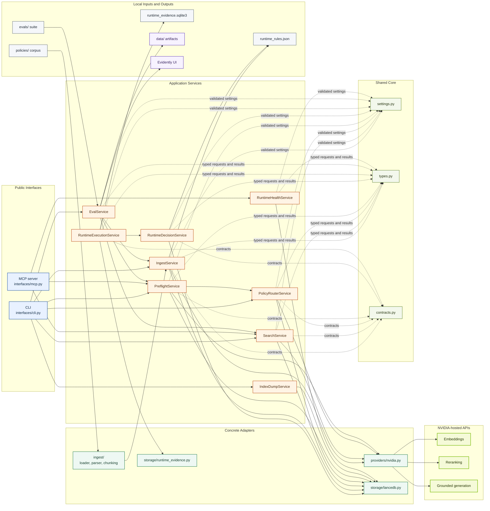
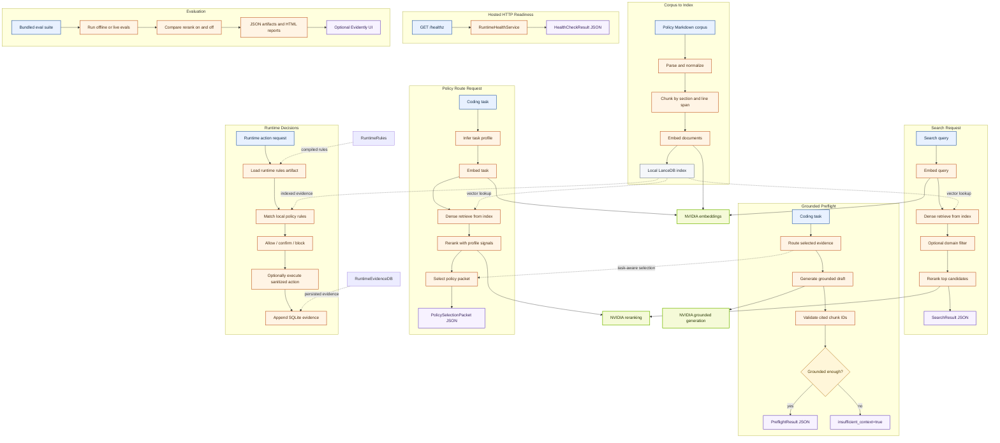

# PolicyNIM Architecture Diagram

This page gives a visual map of the current PolicyNIM architecture. For the
detailed design notes, package rules, and runtime constraints, see
[architecture.md](architecture.md).

## Module Boundary Map

## Runtime Flow

## Reading Notes

- Blue nodes are public entry points or user-supplied inputs.
- Orange nodes are local application steps owned by PolicyNIM.
- Green-yellow nodes are NVIDIA-hosted model calls.
- Purple nodes are returned outputs or local viewing surfaces.
